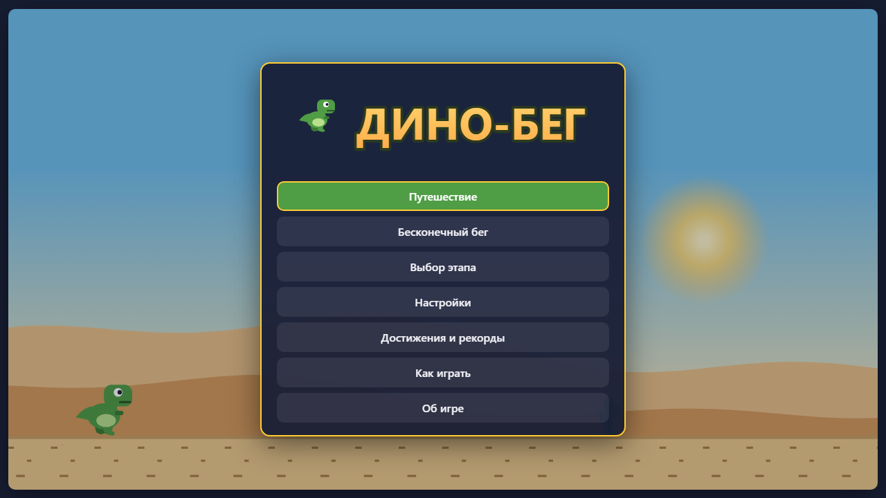
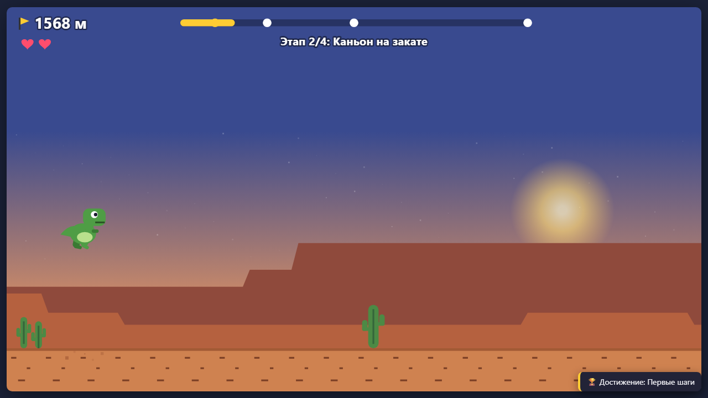

# Dino Run

**English** · [Русский](README.ru.md)

**Dino Run** («Дино-бег») is a runner game in a single HTML page: jump over cacti and duck under birds. It runs in the browser with no server and no internet: open `index.html` or play it online.

**[▶ Play online](https://alexalesha.github.io/DinoRun/)**

> Fan-made game. Not affiliated with the rights holder of the dinosaur game in a well-known browser.

The interface is in Russian.





## What is in the game

- **Journey:** four stages to the finish at 10,000 m - desert, canyon at sunset, night steppe and a snowy pass, faster with each stage; the start of a stage is a checkpoint.
- **Endless run:** one life, day turns into night, the speed grows; the goal is a record.
- Birds fly high, middle and low: duck under the middle ones, jump over the low ones.
- Achievements and records, settings with key rebinding, gamepad support.
- Sprites are drawn by code, sounds and music are synthesised with WebAudio; no files from the internet.

## Controls

| Key | Action |
|---|---|
| Space, ↑, click or tap | jump (hold to jump higher) |
| ↓ or S | duck; in the air - fall faster |
| Esc | pause |

Keys can be changed in the settings where the game offers it; a gamepad works too where noted above.

## Run locally

Open `index.html` in Chrome, Edge or Firefox. Everything is in the repository; nothing is downloaded.

## Tests

The laws are Playwright tests in `tests/`. They open the page by its file address in headless
Chromium, one at a time:

```
npm install
npx playwright install chromium
npm test
```

Mouse capture in the tests is always a stub (a real `requestPointerLock` in headless Chromium on
Windows can clip the user's cursor).
The pictures above were made headless by the screenshot script of the GameRoom collection.

## History

The game was made in the [GameRoom](https://github.com/ALEXalesha/GameRoom) collection (folder `web/dino`), where it also runs in the Igroteka launcher ([play there](https://alexalesha.github.io/GameRoom/)). This repository carries the game with its commit history.

## Licence

MIT, see [LICENSE](LICENSE).
